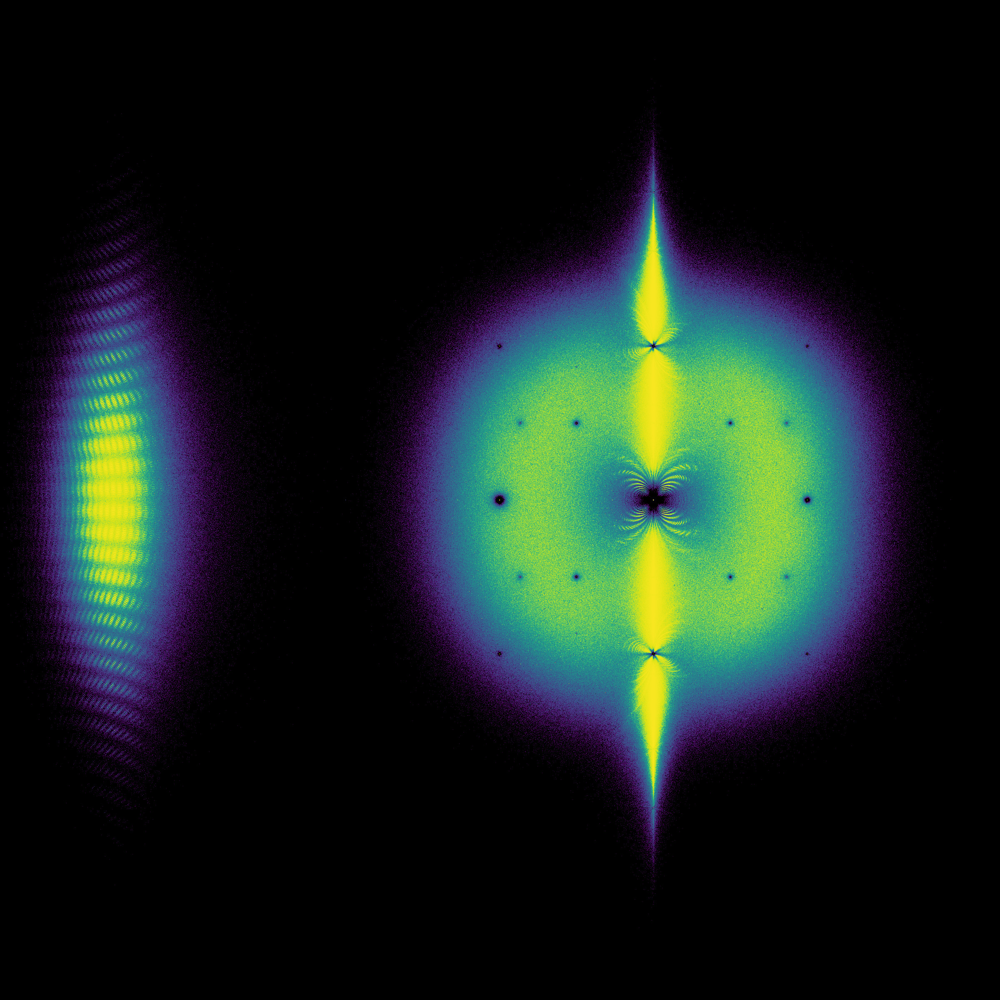

<H4> Maple Transactions </H4>
I am the Editor-in-Chief for <A HREF="http://www.mapletransactions.org"> Maple Transactions </A>, a new open-access scholarly journal.  The purpose of Maple Transactions is to disseminate excellent expositions on topics of interest to the Maple community.  There are no page charges, and you need not use Maple to be published in this journal.

<H4> My current obsession: Bohemian Matrices </H4>

<A HREF="https://en.wikipedia.org/wiki/Bohemian_matrices"> The Wikipedia entry on Bohemian Matrices </A>

<H4> My new book, with Neil Calkin and Eunice Chan! Open access, and in beta: comments welcome! </H4>

<A HREF="https://computational-discovery-on-jupyter.github.io/Computational-Discovery-on-Jupyter/index.html"> Computational Discovery on Jupyter </A>

Chapter 4 (or is it Unit 4?  With a Jupyter Book the old words for divisions of a book are a bit obsolete) covers Bohemian matrices at an entry level.
  
<!--  -->

  
<b> The Bohemian Calendar 2022 is out! (Many images produced by the code from the book above) </b>   <A HREF="https://creativecommons.org/licenses/by-sa/4.0/"> Licensed under CC-by-SA 4.0. </A>
  <ul>
    <li> <A HREF="2022_Bohemian_Wall_CalendarLetterSundayWeek.pdf"> Letter paper, week starts Sunday </A> </li>
    <li> <A HREF="2022_Bohemian_Wall_CalendarLetterMondayWeek.pdf"> Letter paper, week starts Monday </A> </li>
    <li> <A HREF="2022_Bohemian_Wall_CalendarA4SundayWeek.pdf"> A4 paper, week starts Sunday </A> </li>
    <li> <A HREF="2022_Bohemian_Wall_CalendarA4MondayWeek.pdf"> A4 paper, week starts Monday </A> </li>
  </ul>

See <A HREF="https://www.bohemianmatrices.com"> bohemianmatrices.com </A> for more information about Bohemian matrices.  

<!-- But here's an image, just for a teaser.

 -->

<h4> Research Interests </h4>

I have three major overlapping research areas: computational dynamical systems, computational algebra, and computational special functions, each of which is used in scientific and engineering applications. 
<!---The applications I and others have used my work for include flow-induced vibration of artificial structures, financial options, cardiac simulations, and the kinetics of dark adaptation in the human eye.  --->
My main overall concern is for the fidelity and reliability of these algorithms in actual applications. 
<!--- Of course, everyone wants to solve problems quickly, but no-one wants this at the expense of unreliable predictions. --->
The main approach that I use is <A HREF="https://github.com/rcorless/rcorless.github.io/blob/main/CMTpaper.pdf">Computer-Mediated Thinking</A> or <em>Computational Discovery</em>, or <em>Computational Epistemology</em>. 
That link goes to a paper describing that idea in a <em>teaching</em> context, but it is a much broader idea, namely that the combination of human plus computer, especially equipped with thin slices of Artificial Intelligence, can be better than the human alone. 
<!--- Obviously this <em>might</em> be true, but making sure that it <em>is</em> true is harder, and more important, than it looks. --->

<ul>
<li><a HREF="https://github.com/rcorless/rcorless.github.io/blob/main/CV.pdf"> My academic CV as of Marc 23, 2022 </a> </li>
<li><a HREF="https://scholar.google.ca/citations?user=SyLAxDkAAAAJ&hl=en"> My Google Scholar profile </a> </li>
<li><a HREF="https://www.youtube.com/channel/UCcFY7USfrgQn5lgNm_ouApw"> My YouTube Channel </a> 

My channel includes some talks, and some course videos. I'm still learning, but making the videos is quite fun! There will be more.
 </li>
<li> <a href="https://www.rotman.uwo.ca/"> My computational discovery and epistemology home: The Rotman Institute of Philosophy </a> </li>
<li> <a href="http://www.orcca.on.ca"> My computer algebra research group: The Ontario Research Centre for Computer Algebra </a> </li>
<li> <a href="https://www.linkedin.com/in/rob-corless-9747667"> My LinkedIn profile </a> </li>
</ul>

<a href="https://www.growkudos.com/publications/10.1145%25252F3452143.3465547/reader"> ACM says "Kudos" are important.  Are they? Here is one of my papers, "kudo-ized." I suspect this fad will fade away.</a>

<H4> Books </H4>
<OL>
<LI> <a href="https://www.springer.com/us/book/9783030816971"> Maple in Mathematics Education and Research </a> an edited 2021 volume containing selected papers from the <a href="https://de.maplesoft.com/mapleconference/2020/"> Maple Conference 2020 </a>.  Videos of talks still available at that link. </LI>
<LI> <a href="https://www.springer.com/us/book/9781493990504"> Algorithms and Complexity in Mathematics, Epistemology and Science (ACMES) </a> An edited 2019 volume containing papers from the <a href="http://acmes.org/">Computational Discovery/Computational Epistemology conferences </a></LI>
<LI> <a href="http://www.nfillion.com/">Nic Fillion </a> and I wrote <a href="https://www.springer.com/gp/book/9781461484523">“A Graduate Introduction to Numerical Methods, From the Viewpoint of Backward Error Analysis”</a> together for 2013. Here are some excerpts from <a href="http://www.bookmetrix.com/detail_full/book/0b3312d9-f0a9-4fe1-b700-37c52a50220d#reviews"> reviews of the book </a></LI>
  <LI> <a href="https://www.springer.com/us/book/9780387953526"> Essential Maple </A> 2nd edition, 2002, foolishly entitled "Essential Maple 7". </LI>
</OL>

<H4> Code Repositories for Books and Papers </H4>

<OL>
  <LI> <A HREF="https://github.com/rcorless/Perturbation-Methods-in-Maple">Perturbation Methods in Maple</A> from the ACMES book listed above </LI>
  <LI> <a href="http://www.nfillion.com/coderepository/index.php"> Nic Fillion's code repository for "A Graduate Introduction to Numerical Methods, From the Viewpoint of Backward Error Analysis" </a> </LI>
</OL>

<H4> Maple Documents and Workbooks and Worksheets and PDFs from talks </H4>
A free Maple Player which can read these items is available at <A HREF="https://www.maplesoft.com/products/maple/Mapleplayer/"> Mapleplayer </A> .
<OL>
  <LI> <A HREF="ATCM_Invited_Talk.pdf"> Computational Discovery with Newton Fractals, Bohemian Matrices, & Mandelbrot Polynomials (for ATCM) </A></LI>
  <LI> <A HREF="Symbolic_Numeric_Computing_for_Bohemian_Matrices.pdf"> Hybrid symbolic-numeric methods for Bohemian matrices </A></LI>
  <LI> <A HREF="https://github.com/rcorless/Puiseux-series-Mathieu-double-points/blob/main/MathieuTalk.maple"> Mathieu Functions: A Historical Perspective </A></LI>
  <LI> <A HREF="https://github.com/rcorless/rcorless.github.io/blob/main/BlendsTalk.maple"> Blends in Maple </A> from the Maple Conference 2020 </LI>
  <LI> <A HREF="https://github.com/rcorless/rcorless.github.io/blob/main/InverseGammaTalk.mw"> The Functional Inverse of Gamma </A> from a number of places </LI>
</OL>

<a HREF="allergies.html"> My (boring) allergies, as of October 2021 </A>
